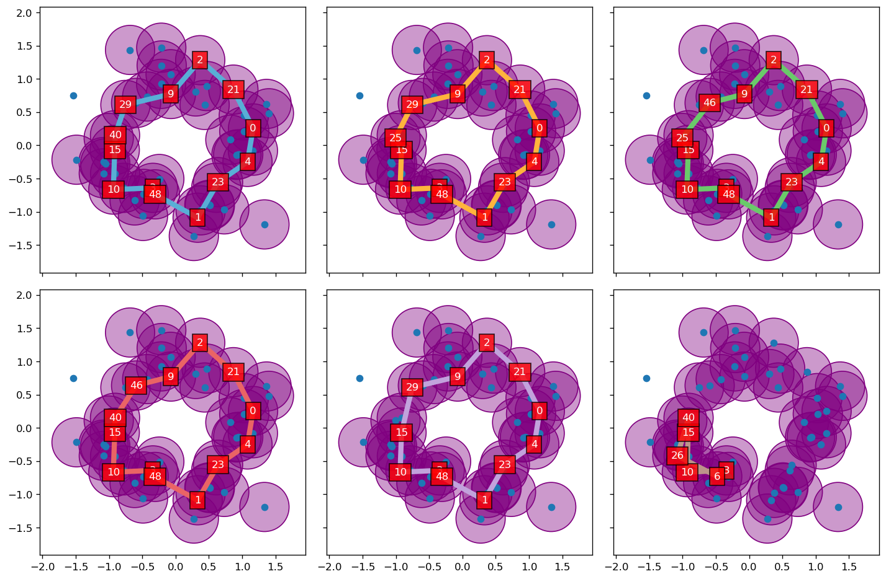

What is this?
---

This is a work-in-progress of a Python3
implementation for (persistent) homology working
primarily with numpy, and matplotlib for visualization.
My long-term goal is to build a code that
exposes enough of the innards of the underlying algorithms
that one can directly work with/study generators associated with
topological features (e.g. loops, void spaces) in a flexible way.

Why do this?
---

I'm an applied mathematician. I have never taken topology, algebra,
etc, but I do have a little experience in graph theory and
(numerical) linear algebra.
Given that context, though I see and appreciate the
potential utility of topological data analysis, the
language barrier used by practitioners is a little too much
for me, honestly.

I'm told that identifying generators (i.e. a collection of
data points/vertices/etc) associated with a topological feature
(a non-trivial loop or void space) in a point cloud
is not a completely solved question, especially if one
desires a "minimal" generator (probably because "minimal" is
an application-specific question). From my little exploration
into the space of TDA tools, some packages simply can't provide this
information, and others **maybe perhaps** do, but it's beyond me
on how to access them because of the language barrier.

I also have a specific application project which is, in part, interested
in identifying generators, because this is what a non-mathematician really
cares about.

Requirements
---

Python packages:
* numpy
* matplotlib
* scikit-learn (this can be easily removed as a dependency)

How does it work? What's in here?
---

This code is a practice in my own self-teaching and slowly building
up tools and understanding as I go along. Given that, there's
a couple aspects to the code currently:

* You can study and run the "examples" (they're not really examples)
`ex1.py`, `ex2.py`, etc., in which I try to slowly build up from
simple substeps and pieces of the overall persistent homology pipeline
to more complex tasks
* A couple examples solely focusing on boundary operators coming
from Chad Topaz's examples (see below for links) are in `chad_bdry_ex1.py`
and my own extension of this in `chad_bdry_ex2.py`
* The primordial-ooze-of-a-coherent-package is still being built up;
currently this consists of...
  * `examples.py` : a small module to generate a few toy datasets
(point clouds in two dimensions) to visualize and sanity-check my functions.
  * `distmat2.py` : a distance matrix class which is the backbone
necessary to expose topological features (vertices, edges, cliques),
and later try to facilitate the actual persistent homology.
  * `point_cloud.py` : a small module to make the point cloud figures
with epsilon-balls drawn on all (or some) of the points.
  * `intmatop.py` : What amounts to a small linear algebra library for
working in the integers (just the plain old integers).
There are planned future upgrades here;
in particular switching to sparse matrix formats (the boundary
operators are very sparse).
  * `utils.py` : miscellaneous, but important, functions. In particular
the functions for constructing the boundary operators partial_1 and partial_2
are in here.

Credits
---

I have to give a good deal of credit to Chad Topaz's pdf guide,
and in retrospect, Dr. Brittany Fasy's tutorial at the ICERM workshop
*Applied Mathematical Modeling with Topological Techniques* (though
I wasn't sharp enough to understand it at the time) with getting me started.

* [Article](https://dsweb.siam.org/The-Magazine/Article/topological-data-analysis-1) and
[notes](https://drive.google.com/file/d/0B3Www1z6Tm8xblBVRFBpeWpfREk/view) by Chad Topaz (of Williams College)
* Lectures by Brittany Fasy (of Montana State) at the ICERM workshop
"Applied Mathematical Modeling with Topological Techniques", August 2019
(on Monday and Tuesday) https://icerm.brown.edu/topical_workshops/tw19-6-ammtt/
